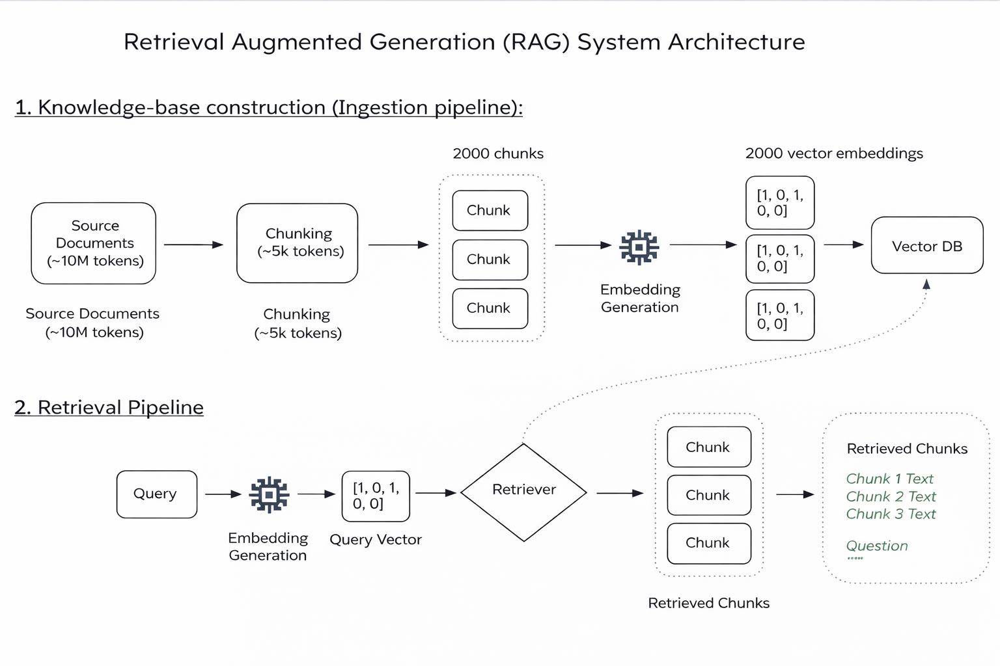

# RAG Pipeline Project

A Retrieval-Augmented Generation (RAG) pipeline that allows users to
send queries via API and receive intelligent responses based on indexed
documents.

------------------------------------------------------------------------

##  Project Overview

This project implements a RAG (Retrieval-Augmented Generation) pipeline
exposed through a simple API endpoint.

The system: - Processes documents - Retrieves relevant context -
Generates responses using an LLM - Exposes a REST endpoint for querying

If the chunks_raw file already exists, a new vector database will be created from it. If it does not exist, the system will first generate the chunks and then create embeddings. If embeddings are already available, they will not be generated again.

Configure environment variables GOOGLE_API_KEY in .env file.

------------------------------------------------------------------------

##  Architecture



##  Setup Instructions

### 1️ Create Virtual Environment

``` bash
python -m venv venv
```

### Activate Virtual Environment

**Windows**

``` bash
./venv/Scripts/activate.bat
```

**macOS / Linux**

``` bash
source venv/bin/activate
```

------------------------------------------------------------------------

### 2️ Install Python Dependencies

``` bash
pip install -r requirements.txt
```


------------------------------------------------------------------------

##  System Dependencies

### Linux (Ubuntu/Debian)

``` bash
sudo apt update
sudo apt install poppler-utils tesseract-ocr libmagic1 -y
```

### macOS (Homebrew)

``` bash
brew install poppler tesseract libmagic
```

### Windows

Install using Chocolatey:

``` bash
choco install poppler -y
choco install tesseract -y
choco install libmagic -y
```

Or download and install manually from official sources and add them to
your System PATH.

------------------------------------------------------------------------

## ▶ Running the Server

``` bash
python server.py
```

Server runs at:

    http://localhost:8000

------------------------------------------------------------------------

##  API Usage

### Endpoint

    POST http://localhost:8000/ask

### Request raw json Body

``` json
{
    "query": "How does Prudential manage market risk?"
}
```

### Example using curl

``` bash
curl -X POST "http://localhost:8000/ask"      -H "Content-Type: application/json"      -d '{"query":"How does Prudential manage market risk?"}'
```

------------------------------------------------------------------------

##  Architecture Overview

1.  Document ingestion
2.  Text preprocessing / OCR
3.  Embedding generation
4.  Vector storage
5.  Similarity search
6.  Context injection into LLM
7.  Response generation

------------------------------------------------------------------------

##  Project Structure

    project/
    │
    ├── server.py
    ├── ingestion-pipeline.py
    ├── main.py
    ├── retrieval_pipeline.py
    ├── requirements.txt
    ├── README.md
    └── venv/

------------------------------------------------------------------------

##  Notes

-   Ensure system dependencies are installed before running the server.
-   Confirm port 8000 is available.
-   sample_questions_answers.txt contains the sample input and outputs.
-   Configure environment variables GOOGLE_API_KEY in .env file.

------------------------------------------------------------------------

